# The 3rd Project Portfolio of CI

## Webalyzer

Is a Python terminal-based app that validates HTML and CSS through validator.nu and jigsaw.w3.org.

Project URL: [View live project](https://webalyzer.herokuapp.com "Webalyzer")

 

## User Experience (UX)

-   ### User stories

    -   #### First Time Visitor Goals

        1. I want to understand the site's primary purpose quickly.
        2. I want the app to give options related to it's branding.
        3. I want to use the app without any issues.
        4. I want the app to continue on until I close the program.
        5. I want the provide an about section if interested.

    -   #### Returning Visitor Goals

        1. I want the app to offer quick access to it's options.

         

## Table of Contents

* [Planes](#planes)
    * [The Surface](#surface)
    * [Skeleton](#skeleton)
    * [Structure](#structure)
    * [Scope](#scope)
    * [Strategy](#strategy)
* [Development](#development)
    * [HTML](#dev-html)
    * [CSS](#dev-css)
    * [Python](#dev-python)
    * [Testings](#testings)
    * [Bugs](#bugs)
* [Validator](#validator)
* [Deployment](#deployment)
    * [Fork](#fork)
    * [Clone](#clone)
    * [Deploy](#deploy)
* [Credits](#credits)

 

## Planes

 

### Surface

#### Wireframe

I created wireframes for mobile and desktop screens, while both terminal and reload button are all set to display none for screens below 1279 pixels. The initial project name was websichanic, inspired by TextMechanic, later changed to Webalyzer to be aligned with the shape the project has taken.

| Mobile | Desktop |
|:--------:|:--------:|
|  |  |

 

-   #### Colour Scheme

    -   I produced all imagery from the shades of the primary three colors:
    
    | #HEX | Color |
    |:--------:|:--------:|
    | #26396A ||
    | #444655 ||
    | #A8AABC ||

    - The terminal uses the colors of; base white, yellow, blue, red and magenta.

     

    #### Typography

    -   [VT323](https://fonts.google.com/specimen/VT323?category=Monospace "fonts.google.com/specimen/VT323") is used to give the app a computerized theme.

     

-   #### Imagery

    -   The purpose of the images is to make the app more appealing.
    -   The colors and images all serve to be aligned with and assist in the app's branding.
    -   The images also intend to give the app an identity the user can relate to, lifting its overall impression.

     
    
    All images were produced using Adobe illustrator:

    -   Background image:

     

    

     

    -   Favicon image:

     

    

     

    -   Social image card:

     

    

 

### Skeleton

 

The app will greet the user with a welcome screen where the user can choose between 2 options yes or no, read about Webalyzer, or continue.

 

Choosing to read about Webalyzer, the user will be able to read a few short lines that summarize what Webalyzer is all about and who made it.

 

Whether choosing not to read about Webalyzer or continuing after reading, the user will be presented with a screen that has an input to put a URL.

 

After successfully validating the URL, the user will be met with two choices. 1. option to validate HTML or 2. option to validate CSS. While the URL is being validated, the user receives feedback with the intention that the app is working and something is happening. Depending on the result, the user will see a no error message and choose to validate another option, another URL, or quit. If the validation includes errors, the user will see a list of errors, on which line, which error, and for what, precisely as the user would if visited the 3rd-party validator.

 

When the user chooses to quit the app, an outro will show with Webalyzer's name and a short friendly goodbye message.

 

### Structure

 

#### App Flow

The app structure should not be more than three levels deep and should be user-friendly to quickly find what the user wants. Below is a chart showcasing the flow structure and functionality of the app.

 

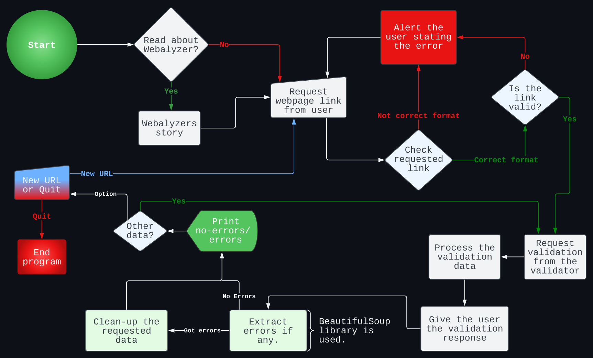

 

#### App Logic

Below is a chart showcasing the logic behind the app.

 

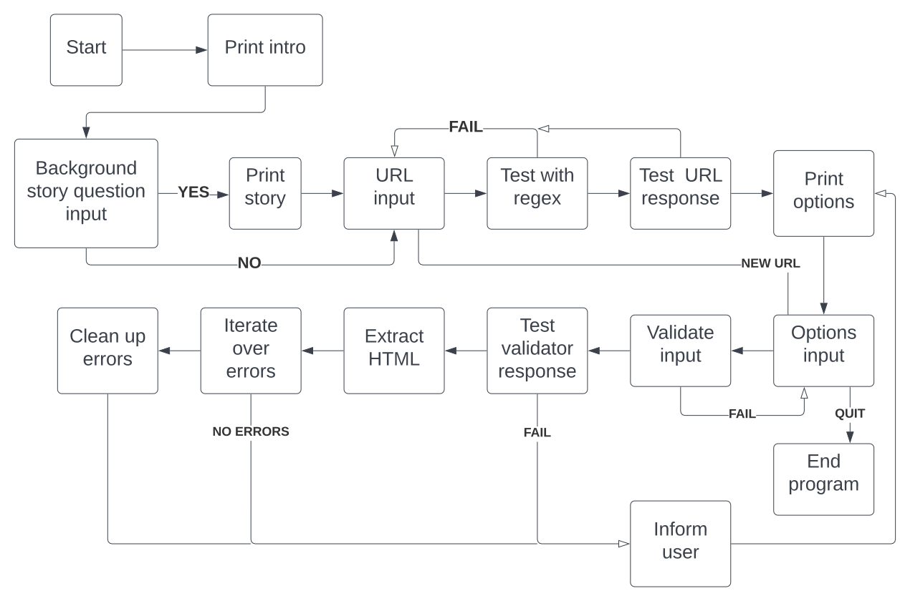

 

### Scope

#### Minimum viable product

The minimum features the app must include are the following:

- To validate the HTML of a webpage.

- To validate the CSS of a webpage.

#### Desired features

The desired features the app could contain includes the following:

- To validate the standard `https://html.spec.whatwg.org` meta tags of a website.

- To scrape and validate all links of a webpage.

- To validate the JavaScript of a webpage.

- To validate a Python file.

- To add bulk URLs to validate/scrape.

 

### Strategy

I was asking myself what's current needs based on my current surrounding. Web Developers! Questions come to mind: What could web developers use that could potentially save time? What features could be needed? As a web developer, saving time is always good, as time is limited.

Nowadays, developers need to check their code through multiple validators, going from one app or site to another. What about those who do not use VScode or other code editors with linting capability? That's where Webalyzer gets into the picture.

Webalyzer, short for "website analyzer," is based on real-world websites like validator.nu HTML validator(a validator.w3.org clone), and jigsaw.w3.org, a CSS validator. The app takes input for a URL and displays the result to the user.

 

## Development

#### Languages Used

- [HTML](https://en.wikipedia.org/wiki/HTML "Wikipedia's HTML page")
- [CSS3](https://en.wikipedia.org/wiki/Cascading_Style_Sheets "Wikipedia's CSS3 page")
- [Python](https://en.wikipedia.org/wiki/Python_(programming_language) "Wikipedia's Python page")

 

### Frameworks, Libraries & Programs Used

 

1. [Mockflow:](https://mockflow.com/ "mockflow.com")
    - Mockflow was used to create the wireframes during the design process.
2. [Git:](https://git-scm.com/ "git-scm.com")
    - Git was used for version control by utilizing the Gitpod terminal to commit to Git and Push to GitHub.
3. [GitHub:](https://github.com/ "github.com")
    - GitHub is used to store the project's code after being pushed from Git.
4. [Heroku:](https://www.heroku.com "heroku.com")
    - Heroku is a container-based cloud Platform as a Service (PaaS). Developers use Heroku to deploy, manage, and scale modern apps. Project is hosted on Heroku for viewing and interacting with the app.
5. [Requests:](https://pypi.org/project/requests/ "pypi.org/project/requests/")
    - Requests is a simple, yet elegant, HTTP library. Webalyzer uses requests to interact with 3rd-party app's.
6. [html5lib:](https://pypi.org/project/html5lib/ "pypi.org/project/html5lib/")
    - html5lib is a pure-python library for parsing HTML. It is designed to conform to the WHATWG HTML specification, as is implemented by all major web browsers. html5lib is used for parsing the HTML of the validators.
7. [bs4:](https://pypi.org/project/beautifulsoup4/ "pypi.org/project/beautifulsoup4/")
    - Beautiful Soup is a library that makes it easy to scrape information from web pages. It sits atop an HTML or XML parser, providing Pythonic idioms for iterating, searching, and modifying the parse tree. Beautiful Soup is used to extract the targeted html of the validators.
8. [sys:](https://docs.python.org/3/library/sys.html "docs.python.org/3/library/sys.html")
    - This module provides access to some variables used or maintained by the interpreter and to functions that interact strongly with the interpreter. It is always available. Sys is used for slow printing text on the terminal, restarting the terminal, deleting lines, and exiting the terminal.
9. [time:](https://docs.python.org/3/library/time.html "docs.python.org/3/library/time.html")
    - This module provides various time-related functions. Time is used to make the terminal sleep for x seconds.
10. [re:](https://docs.python.org/3/library/re.html "docs.python.org/3/library/re.html")
    - This module provides regular expression matching operations similar to those found in Perl. Re is used to match regular expression againt URLs and text in HTML.
12. [httperror:](https://docs.python.org/3/library/urllib.error.html#urllib.error.HTTPError "docs.python.org/3/library/urllib.error.html")
    - Useful when handling exotic HTTP errors. Httperror is used to handle http errors.
13. [tprint from art:](https://pypi.org/project/art/ "pypi.org/project/art/")
    - ART is a Python lib for text converting to ASCII art. ART is used to print ASCII text in the terminal.
14. [Lucidchart:](https://www.lucidchart.com "lucidchart.com")
    - Lucidchart is the intelligent diagramming application that brings teams together to make better decisions and build the future. Lucid chart is used to make the flow and logic charts.
15. [Adobe Illustrator:](https://www.adobe.com/products/illustrator.html "adobe.com/products/illustrator.html")
    - Adobe Illustrator is vector-based graphics software that lets you scale down your artwork for mobile screens or scale up to billboard size. Illustrator is used to create all images.
16. [Google fonts:](https://fonts.google.com "fonts.google.com")
    - Google Fonts makes it easy to bring personality and performance to websites and products. Google fonts is used for the typography of app outside of the terminal.
17. [Font Awesome:](https://fontawesome.com "fontawesome.com")
    - Font Awesome is the Internet's icon library and toolkit, used by millions of designers, developers, and content creators. Github icon is used for the author button.

     

### Dev HTML

Code Institutet provided the base HTML that came with the initial project template, and I slightly altered it to move the reload button below the terminal. I added three extra tags to give me more freedom to better control the app's layout and align it with the visualized identity and brand image set in the design stage.

 

### Dev CSS

Initially, I had a small fight with Heroku and realized it was out of this project's scope. Instead of a custom stylesheet file, I added the CSS code to `/views/layout.html`. That works, but I would rather have CSS separate from HTML.

 

### Dev Python

I initially wanted this project to have four options and contemplated how to implement each feature. As it was my first time working with the Python language, I quickly realized that all features I wanted were unrealistic with the short time I had for this project. I implemented only HTML and CSS validation options after leaving out Javascript because of issues related to services validating JS. The tests weren't consistent and unreliable from website to website, especially if JS files were minified or had a nonce attribute.

The produced code successfully validated regular non-minified JS files, but given that successful validation wouldn't be consistent, it would ultimately hurt and put distrust in Webalyzer.

The more I shifted my mindset towards object-oriented programming during development, the more I understood the Python language and its capabilities. Its vast support and unlimited opportunities to implement ideas made me confident in using Python and realizing how easy Python is to learn and use.

I am always on the lookout for how to optimize for better, smarter, shorter, and more performant code.

Like adding a `timeout="10"` to the initial URL input response testing, I cut the wait from 1 min 40 sec down to 14 sec for URLs with timeouts. The main drive for this addition was not to have users become impatient.

During development, try: except: and else: blocks are critical for the app's success, especially when dealing with 3rd-party sources.

Adding features upon features, lots of testing needs to happen. When I added try - except: blocks, I noticed some performance degraded depending on where the try: was added and items included. Trying to find the sweet spot, I successfully gained better performance at the end of the day.

Regex comes in handy when dealing with text and URLs, and one can void many exceptions errors along the way.

 

I can say that I learned a lot about the Python language and feel confident working with it, but I still have much to learn and try.

 

## Testings

### Python Code

I did intensive testing during development, but highlights are available on [Testings.md](./assets/readme//testing/testings.md)

### Lighthouse

Adding an extra google font link with a rel attribute of preload, I successfully cut down the render-blocking time from 1.23s to 0.48s, which is excellent.

| Before Preload |
|:--------:|
|  |

| After Preload |
|:--------:|
|  |

| App Page |
|:--------:|
|  |

 

### Accessibility

The app was tested with [color.a11y.com/Contrast](https://color.a11y.com/Contrast/ "color.a11y.com/Contrast") for any accessability issues.

 

The social card image was tested with [brandwood.com/a11y/](https://www.brandwood.com/a11y/ "brandwood.com/a11y/") for any accessability issues.

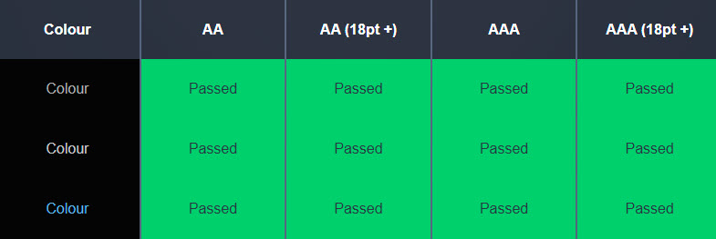

 

### Bugs

I have grown fond of eliminating bugs found in my code as I intentionally try to provoke and find them.

 

I suddenly was faced with a loop that, at first, didn't seem to be found. The issue was I forgot to break out of the loop upon moving and refactoring code. Including the below in red, I successfully fixed the problem.

 

A bug related to the above also appeared while testing the app as both 'y' and 'n' where allowed inputs but was not ment to be valid at the options screen.

 

The solution was to add an if statement targeting the said letters as shown below.

 

## Validator

### Validate Python

I ran all Python code against PEP8's online checker with no errors reported. See screenshots here: [pep8](./assets/readme/pep8/pep8.md)

 

## Deployment

 

### Fork

How to fork this repository:

1. Log in to GitHub and navigate to [this repository](https://github.com/MTraveller/webalyzer).
2. You'll see a button called <b>Fork</b> on the top right side of the page. Click the button to create a copy of this repository to your own GitHub account.

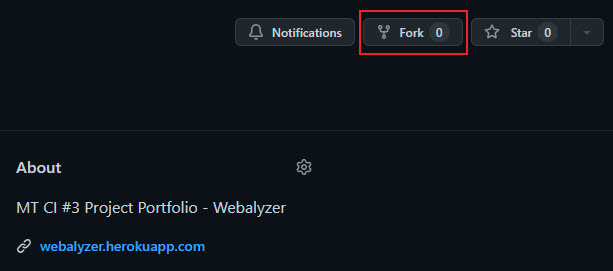

 

### Clone

How to clone this project:

1. Under the repository’s name, click on the <b>Code</b> button.
2. In the <b>HTTPS</b> tap, click on the clipboard icon to copy the given URL.
3. In your IDE of choice, open <b>**git bash**</b>.
4. Change the current working directory to where you want the cloned directory to be.
5. Type <b>**git clone**</b>, paste the URL copied from GitHub - https://github.com/MTraveller/webalyzer.git.
6. Press <b>**enter**</b>, and you are done.

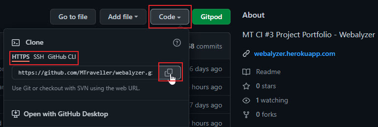

 

### Deploy

To deploy the app to Heroku, navigate to [Heroku.com](https://www.heroku.com "heroku.com") and login into your account or create one if needed. Upon entering your dashboard, create a new app and set the location.

 

| New App | Location |
|:--------:|:--------:|
| 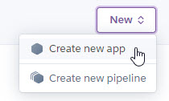 | 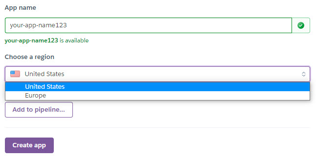 |

 

First, you need to make the necessary settings for this app.

 

| Settings |
|:--------:|
| 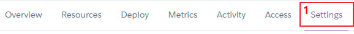 |

 

| Reveal Config Vars | Config Vars |
|:--------:|:--------:|
| 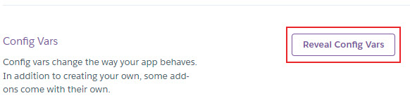 | 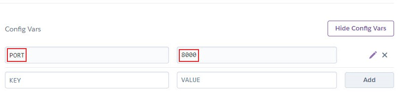 |

 

| Needed Buildpacks | Choose Buildpacks |
|:--------:|:--------:|
| 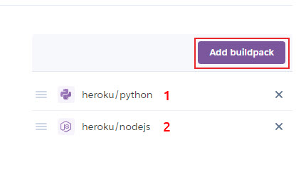 | 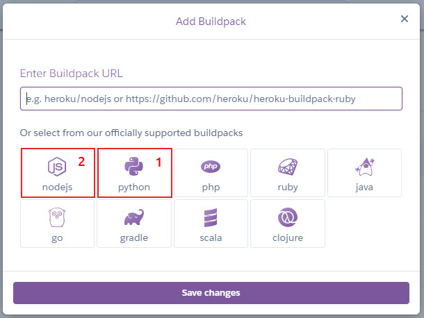 |

 

Then you need to connect your repository to Heroku.

 

| Deploy |
|:--------:|
| 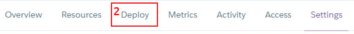 |

 

| Deploy Method |
|:--------:|
| 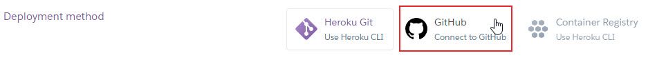 |
| 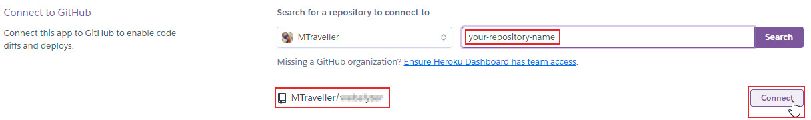 |

 

| Deploy |
|:--------:|
| 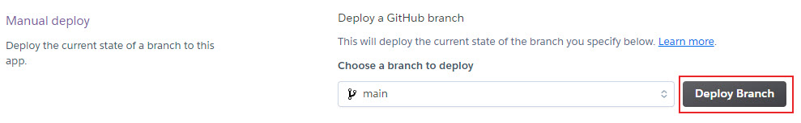 |
| 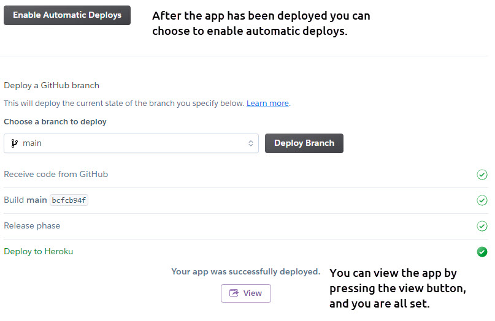 |

 

## Credits

 

### Sources Used

[Python Docs](https://docs.python.org/3.10/ "docs.python.org")

[Python Requests Docs](https://docs.python-requests.org/en/latest/user/quickstart/ "docs.python-requests.org")

[Python Peps](https://peps.python.org/pep-0000/ "peps.python.org")

[Beautiful Soup Doc](https://www.crummy.com/software/BeautifulSoup/bs4/doc/ "crummy.com/software/BeautifulSoup/bs4/doc/")

[Stackoverflow](https://stackoverflow.com "stackoverflow.com")

[Regex101](https://regex101.com "regex101.com")

[Pypi](https://pypi.org "pypi.org")

[ANSI Escape Sequences:](https://gist.github.com/fnky/458719343aabd01cfb17a3a4f7296797 "github.com/fnky/")

[Extended ASCII](https://theasciicode.com.ar/extended-ascii-code/box-drawings-double-horizontal-line-character-ascii-code-205.html "theasciicode.com.ar")

[thisPointer Regex](https://thispointer.com/python-remove-characters-from-string-by-regex-4-other-ways/ "thispointer.com")

[umbraco](https://umbraco.com/knowledge-base/http-status-codes/ "umbraco.com")

Special thanks to [Jayant Malik](https://stackoverflow.com/users/13525989/jayant-malik "stackoverflow.com/users/13525989/jayant-malik") for providing an excellent explanation of Python's circular import issue.

[Stackoverflow ](https://stackoverflow.com/a/62303448 "https://stackoverflow.com/questions/59156895/cannot-import-name-mydb-from-partially-initialized-module-connection-in-pyth")

 

## Acknowledgement

No code within this project is a copy unless specified explicitly in the source code—Code Institute provided the base template for this project. The sources used above provided guidance throughout the development.

This project is part of the "Full Stack Software Developer Diploma" at [Code Institute](https://codeinstitute.net/).

MT 2022.

[Back to top](#the-3rd-project-portfolio-of-ci)