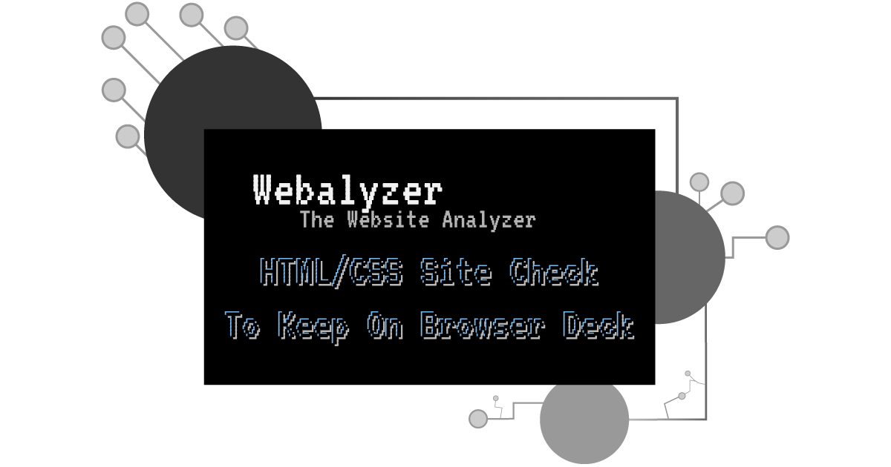

# The 3rd Project Portfolio of CI

## Webalyzer

Is a Python terminal-based app that validates the HTML and CSS through validator.nu and jigsaw.w3.org.

Project URL: [View live project](https://webalyzer.herokuapp.com "Webalyzer")

 

## User Experience (UX)

-   ### User stories

    -   #### First Time Visitor Goals

        1. I want to understand the site's primary purpose quickly.
        2. I want the app to give options related to it's branding.
        3. I want to use the app without any issues.
        4. I want the app to continue on until I close the program.
        5. I want the provide an about section if interested.

    -   #### Returning Visitor Goals

        1. I want the app to offer quick access to it's options.

         

## Table of Contents

* [Planes](#planes)
    * [The Surface](#surface)
    * [Skeleton](#skeleton)
    * [Structure](#structure)
    * [Scope](#scope)
    * [Strategy](#strategy)
* [Development](#development)
    * [HTML](#dev-html)
    * [CSS](#dev-css)
    * [Python](#dev-python)
    * [Testings](#testings)
    * [Bugs](#bugs)
* [Validator](#validator)
    * [Python](#validate-python)
* [Deployment](#deployment)
    * [Fork](#fork)
    * [Clone](#clone)
    * [Deploy](#deploy)
* [Credits](#credits)

 

## Planes

 

### Surface

#### Wireframe

I created wireframes for mobile and desktop screens, while both terminal and reload button are all set to display none for screens below 1279 pixels. The initial project name was websichanic, inspired by TextMechanic, later changed to Webalyzer to be aligned with the shape the project has taken.

| Mobile | Desktop |
|:--------:|:--------:|
|  |  |

 

-   #### Colour Scheme

    -   I produced all imagery from the shades of the primary three colors:
    
    | #HEX | Color |
    |:--------:|:--------:|
    | #26396A ||
    | #444655 ||
    | #A8AABC ||

    - The terminal uses the colors of; base white, yellow, blue and red.

     

-   #### Imagery

    -   The purpose of the images is to make the app more appealing.
    -   The colors and images all serve to be aligned with and assist in the app's branding.
    -   The images also intend to give the app an identity the user can relate to, lifting its overall impression.

     
    
    All images were produced using Adobe illustrator:

    - Background image:

     

    

     

    - Favicon image:

     

    

     

    - Social image card:

     

    

### Skeleton

 

 

 

 

 

 

### Structure

The app's structure should not be more than three levels deep and should be user-friendly to find what the user wants quickly. Below is a chart showcasing the logic structure and functionality of the app.

 

 

### Scope

#### Minimum viable product

The minimum feature the app must contain includes the following features:

- To validate the HTML of a webpage.

- To validate the CSS of a webpage.

#### Desired features

The desired features the app could contain includes the following features:

- To be able to validate the standard `https://html.spec.whatwg.org` meta tags of a website.

- To be able to scrape and validate all links of a webpage.

- To validate the JavaScript of a webpage.

- To validate a Python file.

- To be able to add bulk URLs to validate/scrape.

 

### Strategy

Asking myself, what's current need based on my current surounding. Web Developers! Questions comes to mind like; what could be used by web developers, that could potientially save time? What features could be desired? As a web developer saving time where possible is and will be always good, as time is limited.

Nowadays developers need to check their code through multiple validators, going from one app or site to another. What about those who does not use VScode or other code editors with linting capability? That's where Webalyzer gets into the picture.

Webalyzer, short for "website analyzer" based on real world website's like validator.nu  a HTML validator(a validator.w3.org clone) and jigsaw.w3.org a CSS validator. The app takes an input for a URL and displays the result to the user.

 

## Development

#### Languages Used

- [HTML](https://en.wikipedia.org/wiki/HTML "Wikipedia's HTML page")
- [CSS3](https://en.wikipedia.org/wiki/Cascading_Style_Sheets "Wikipedia's CSS3 page")
- [Python](https://en.wikipedia.org/wiki/Python_(programming_language) "Wikipedia's Python page")

 

### Frameworks, Libraries & Programs Used

 

1. [Mockflow:](https://mockflow.com/ "mockflow.com")
    - Mockflow was used to create the wireframes during the design process.
2. [Git:](https://git-scm.com/ "git-scm.com")
    - Git was used for version control by utilizing the Gitpod terminal to commit to Git and Push to GitHub.
3. [GitHub:](https://github.com/ "github.com")
    - GitHub is used to store the project's code after being pushed from Git.
4. [Heroku:](https://www.heroku.com "heroku.com")
    - Heroku is a container-based cloud Platform as a Service (PaaS). Developers use Heroku to deploy, manage, and scale modern apps.
5. [Requests:](https://pypi.org/project/requests/ "pypi.org/project/requests/")
    - Requests is a simple, yet elegant, HTTP library.
6. [html5lib:](https://pypi.org/project/html5lib/ "pypi.org/project/html5lib/")
    - html5lib is a pure-python library for parsing HTML. It is designed to conform to the WHATWG HTML specification, as is implemented by all major web browsers.
7. [bs4:](https://pypi.org/project/beautifulsoup4/ "pypi.org/project/beautifulsoup4/")
    - Beautiful Soup is a library that makes it easy to scrape information from web pages. It sits atop an HTML or XML parser, providing Pythonic idioms for iterating, searching, and modifying the parse tree.
8. [sys:](https://docs.python.org/3/library/sys.html "docs.python.org/3/library/sys.html")
    - This module provides access to some variables used or maintained by the interpreter and to functions that interact strongly with the interpreter. It is always available.
9. [time:](https://docs.python.org/3/library/time.html "docs.python.org/3/library/time.html")
    - This module provides various time-related functions.
10. [re:](https://docs.python.org/3/library/re.html "docs.python.org/3/library/re.html")
    - This module provides regular expression matching operations similar to those found in Perl.
12. [httperror:](https://docs.python.org/3/library/urllib.error.html#urllib.error.HTTPError "docs.python.org/3/library/urllib.error.html")
    - Useful when handling exotic HTTP errors.
13. [tprint from art:](https://pypi.org/project/art/ "pypi.org/project/art/")
    - ART is a Python lib for text converting to ASCII art
14. [Lucidchart:](https://www.lucidchart.com "lucidchart.com")
    - Lucidchart is the intelligent diagramming application that brings teams together to make better decisions and build the future.
15. [Adobe Illustrator:](https://www.adobe.com/products/illustrator.html "adobe.com/products/illustrator.html")
    - Adobe Illustrator is vector-based graphics software that lets you scale down your artwork for mobile screens or scale up to billboard size.
16. [Google fonts:](https://fonts.google.com "fonts.google.com")
    - Google Fonts makes it easy to bring personality and performance to websites and products.
17. [Font Awesome:](https://fontawesome.com "fontawesome.com")
    - Font Awesome is the Internet's icon library and toolkit, used by millions of designers, developers, and content creators.

     

### Dev HTML

Code Institutet provided the base HTML that came with the initial project template, and I slightly altered it to move the reload button below the terminal. I added three extra tags to give me more freedom to better control the app's layout and align it with the visualized identity and brand image set in the design stage.

 

### Dev CSS

Initially, I had a small fight with Heroku and realized it was out of this project's scope. Instead of a custom stylesheet file, I added the CSS code to `/views/layout.html`. That works, but I would rather have CSS separate from HTML.

 

### Dev Python

I initially wanted this project to have four options and contemplated how to implement each feature. As it was my first time working with the Python language, I quickly realized that all features I wanted were unrealistic with the short time I had for this project. I implemented only HTML and CSS validation options after leaving out Javascript because of issues related to services validating JS. The tests weren't consistent and unreliable from website to website, especially if JS files were minified or had a nonce attribute.

The produced code successfully validated regular non-minified JS files, but given that successful validation wouldn't be consistent, it would ultimately hurt and put distrust in Webalyzer.

The more I shifted my mindset towards object-oriented programming during development, the more I understood the Python language and its capabilities. Its vast support and unlimited opportunities to implement ideas made me confident using Python and realizing how easy Python is to learn and use.

I am always on the lookout for how to optimize for better, smarter, shorter, and more performant code.

Like adding a `timeout="10"` to the initial URL input response testing, I cut the wait from 1 min 40 s down to 14s from URLs with timeouts. The main drive for this addition was not to have users become impatient.

During development, try: except: and else: blocks are critical for the app's success, especially when dealing with 3rd-party sources.

Adding features upon features, lots of testing needs to happen. When I added try - except: blocks and noticed some performance degrade depending where the try: was added and items included. Trying to find the sweet spot, I successfully gained better performance at the end of the day.

Regex comes in handy when dealing with text and URLs, and one can void many exceptions errors along the way.

 

I can say that I learned a lot about the Python language and feel confident working with it, but I still have much to learn and try.

 

## Testings

### Python Code

Intensive testing was done and is available here: [Testings.md](./assets/readme/testings.md)

### Lighthouse

Adding an extra google font with a rel attribute of preload, I successfully cut down the render-blocking time from 1.23s to 0.48s, which is excellent.

| Before Preload |
|:--------:|
|  |

| After Preload |
|:--------:|
|  |

| App Page |
|:--------:|
|  |

 

The app was also testing with [color.a11y.com/Contrast](https://color.a11y.com/Contrast/ "color.a11y.com/Contrast") for any accessability issues.

 

### Bugs

I have grown fond of eliminating bugs found in my code as if I am intentionally trying to call them out and spot them wherever possible.

 

I suddenly was faced with a loop that, at first, didn't seem to be found. The issue was I forgot to break out of the loop upon moving and refactoring code. Including the below in red, I successfully fixed the problem.

 

A bug related to the above also appeared while testing the app as both 'y' and 'n' where allowed inputs but was not ment to be valid at the options screen.

 

The solution was to add an if statement targeting the said letters as shown below.

 

## Validator

### Validate Python

I ran all Python code against PEP8's online checker with no errors reported. See screenshots here: [pep8](./assets/readme/pep8.md)

 

## Deployment

 

### Fork

 

### Clone

 

### Deploy

 

## Credits

 

### Sources Used

[Python Docs](https://docs.python.org/3.10/ "docs.python.org")

[Python Requests Docs](https://docs.python-requests.org/en/latest/user/quickstart/ "docs.python-requests.org")

[Python Peps](https://peps.python.org/pep-0000/ "peps.python.org")

[Beautiful Soup Doc](https://www.crummy.com/software/BeautifulSoup/bs4/doc/ "crummy.com/software/BeautifulSoup/bs4/doc/")

[Stackoverflow](https://stackoverflow.com "stackoverflow.com")

[Regex101](https://regex101.com "regex101.com")

[Pypi](https://pypi.org "pypi.org")

[ANSI Escape Sequences:](https://gist.github.com/fnky/458719343aabd01cfb17a3a4f7296797 "github.com/fnky/")

[Extended ASCII](https://theasciicode.com.ar/extended-ascii-code/box-drawings-double-horizontal-line-character-ascii-code-205.html "theasciicode.com.ar")

[thisPointer Regex](https://thispointer.com/python-remove-characters-from-string-by-regex-4-other-ways/ "thispointer.com")

[umbraco](https://umbraco.com/knowledge-base/http-status-codes/ "umbraco.com")

Special thanks to [Jayant Malik](https://stackoverflow.com/users/13525989/jayant-malik "stackoverflow.com/users/13525989/jayant-malik") for providing an excellent explanation of Python's circular import issue.

[Stackoverflow ](https://stackoverflow.com/a/62303448 "https://stackoverflow.com/questions/59156895/cannot-import-name-mydb-from-partially-initialized-module-connection-in-pyth")

 

## Acknowledgement

No code within this project has been copied other than the provided base template by Code Institute. The sources used above provided guidance throughout the development.

This project is part of the "Full Stack Software Developer Diploma" at [Code Institute](https://codeinstitute.net/).

MT 2022.

[Back to top](#the-3rd-project-portfolio-of-ci)