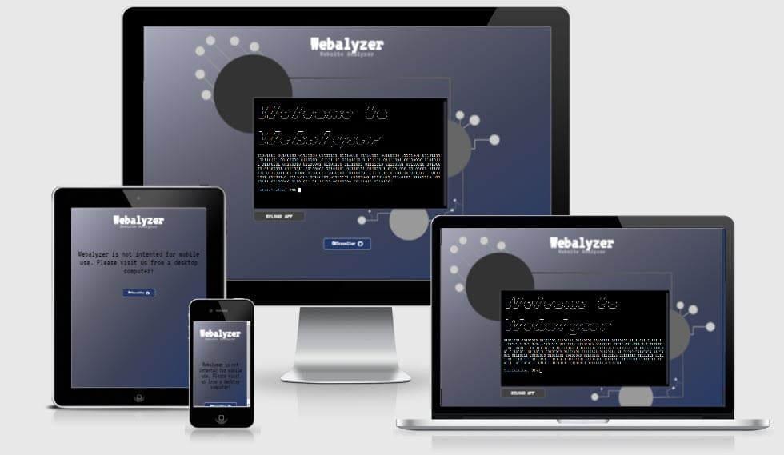

# The 3rd Project Portfolio of CI

### Webalyzer

Project URL: [View live project](https://webalyzer.herokuapp.com "Webalyzer")

 

## User Experience (UX)

-   ### User stories

    -   #### First Time Visitor Goals

        1. I want to understand the site's primary purpose quickly.
        2. I want the app to give options related to it's branding.
        3. I want to use the app without any issues.
        4. I want the app to continue on until I close the program. 

    -   #### Returning Visitor Goals

        1. I want the app to offer quick access to it's options.
        2. I want the app to provide a help doc. if needed.

         

## Table of Contents

* [Planes](#planes)
    * [The Surface](#surface)
    * [Skeleton](#skeleton)
    * [Structure](#structure)
    * [Scope](#scope)
    * [Strategy](#strategy)
* [Development](#development)
    * [HTML](#dev-html)
    * [CSS](#dev-css)
    * [Python](#dev-python)
    * [Testings](#testings)
    * [Bugs](#bugs)
* [Validator](#validator)
    * [Python](#validate-python)
* [Deployment](#deployment)
    * [Fork](#fork)
    * [Clone](#clone)
    * [Deploy](#deploy)
* [Credits](#credits)

 

## Planes

 

### Surface

 

#### Wireframe

Mockflow.com was used to design the initial layout for the desktop screen only, as the project requirements does not include or mention mobile responsiveness.

| Mobile | Desktop |
|:--------:|:--------:|
|  |  |

 

-   #### Colour Scheme

    -   The app uses three main colors which are:
    
    | #HEX | Color |
    |:--------:|:--------:|
    | #26396A ||
    | #444655 ||
    | #A8AABC ||

    The background image was produced from the shades of the main three colors.

     

-   #### Imagery

    -   I created the images myself and was created to make the app more appealing.
    -   The colors and images all serve to be aligned and assist in the name and branding of app.
    -   They also intent to give the app an identity the user can relate to, lifting it's overall impression.

     

    The background image was produced using adobe's illustrator as it is my preferred tool for working on svg files.

     

    

     

    The favicon image was produced using adobe's illustrator as well.

     

    

     

### Skeleton

(How the infomation implemented), (how will the user navigate), (how the content relate to each other, low, mid top priority, how and where to position content)?
 

### Structure

The structure of app should not be more than 3 levels deep and should be user friendly so that the user quickly finds what the user wants. Below is a chart showcasing the logic structure and functionality of the app. 

 

 

### Scope

#### Minimum viable product

The minimum feature the app must contain includes the following features:

- To validate the HTML of a webpage.

- To validate the CSS of a webpage.

- To validate the Javascript of a website.

#### Desired features

The desired features the app could contain includes the following features:

- To be able to validate the standard `https://html.spec.whatwg.org` meta tags of a website.

- To be able to scrape and validate all links of a webpage.

- To validate a Python file.

- To be able to add bulk URLs to validate/scrape.

 

### Strategy

Webalyzer, short for "website analyzer" based on real world website -TextMechanic, a site I have used and known for a long time. A user can manipulate text, like removing empty lines, trim lines and empty spaces. Tools like removing duplicates and adding string(s) before or/and after a line etc. It's a good toolset to have when working with text. I wanted to create something similar and based on "TM" I came up with Webalyzer. An app that takes an input and gives feedback to the user.

Asking myself, what's current need based on my current surounding. Web Developers! Both new and senior web developers. Questions comes to mind like; what could be used by the web developers, that could potientially save time? What features could be desired? As a web developer saving time where possible is and will be always good, as time is limited.

 

## Development

#### Languages Used

- [HTML](https://en.wikipedia.org/wiki/HTML "Wikipedia's HTML page")
- [CSS3](https://en.wikipedia.org/wiki/Cascading_Style_Sheets "Wikipedia's CSS3 page")
- [Python](https://en.wikipedia.org/wiki/Python_(programming_language) "Wikipedia's Python page")

 

### Frameworks, Libraries & Programs Used

 

1. [Mockflow:](https://mockflow.com/)
    - Mockflow was used to create the [wireframes](#wireframe) during the design process.
2. [Git:](https://git-scm.com/)
    - Git was used for version control by utilizing the Gitpod terminal to commit to Git and Push to GitHub.
3. [GitHub:](https://github.com/)
    - GitHub is used to store the project's code after being pushed from Git.
4. [Heroku:](https://www.heroku.com)
    - Heroku is a container-based cloud Platform as a Service (PaaS). Developers use Heroku to deploy, manage, and scale modern apps.
5. [Requests:](https://pypi.org/project/requests/)
    - Requests is a simple, yet elegant, HTTP library.
6. [html5lib:](https://pypi.org/project/html5lib/)
    - html5lib is a pure-python library for parsing HTML. It is designed to conform to the WHATWG HTML specification, as is implemented by all major web browsers.
7. [bs4:](https://pypi.org/project/beautifulsoup4/)
    - Beautiful Soup is a library that makes it easy to scrape information from web pages. It sits atop an HTML or XML parser, providing Pythonic idioms for iterating, searching, and modifying the parse tree.
8. [sys:](https://docs.python.org/3/library/sys.html)
    - This module provides access to some variables used or maintained by the interpreter and to functions that interact strongly with the interpreter. It is always available.
9. [time:](https://docs.python.org/3/library/time.html)
    - This module provides various time-related functions.
10. [re:](https://docs.python.org/3/library/re.html)
    - This module provides regular expression matching operations similar to those found in Perl.
11. [run:](https://docs.python.org/3/library/subprocess.html#subprocess.run)
    - Used to run new codes and applications by creating new processes.
12. [httperror:](https://docs.python.org/3/library/urllib.error.html#urllib.error.HTTPError)
    - Useful when handling exotic HTTP errors.
13. [sleep:](https://docs.python.org/3/library/time.html#time.sleep)
    - Delay execution for a given number of seconds. The argument may be a floating point number for subsecond precision.
14. [tprint from art:](https://pypi.org/project/art/)
    - ART is a Python lib for text converting to ASCII art

     

### Dev HTML

The base HTML that came with the initial project template which was provided by Code Institute, was used and slightly altered to move the button below the terminal. Three extra tags where added to give me more freedom to better control the layout of the app and make it aligned with the vizualised identity and brand image set in the design stage.

 

### Dev CSS

Initially I had a small fight with Heroku and finally realized it was out of the scope of this project. I added the CSS code to `/views/layout.html` instead of a custom stylesheet file. That works, but I would rather separate the my code based on language and make it more origanized.

 

### Dev Python

 

## Testings

 

### Bugs

 

## Validator

### Validate Python

 

## Deployment

 

### Fork

 

### Clone

 

### Deploy

 

## Credits

### Code

 

### Sources Used

[Python docs](https://docs.python.org/3.10/)

[Python peps](https://peps.python.org/pep-0000/)

[Stackoverflow](https://stackoverflow.com)

[Regex101](https://regex101.com)

[Pypi](https://pypi.org)

[whatwg.org/#standard-metadata-names:](https://html.spec.whatwg.org/multipage/semantics.html#standard-metadata-names)

 

## Acknowledgement

This project is part of the "Full Stack Software Developer Diploma" at [Code Institute](https://codeinstitute.net/).

MT 2022.

[Back to top](#the-3rd-project-portfolio-of-ci)