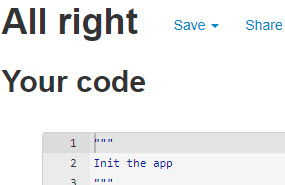
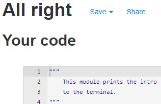
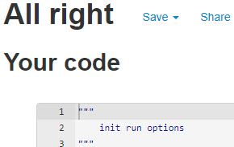
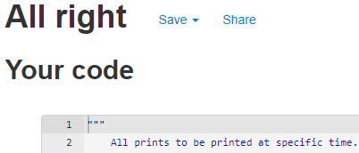
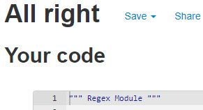
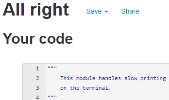
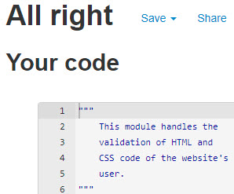
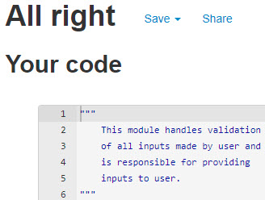
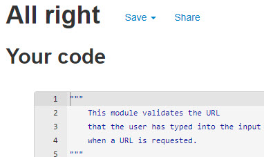

# PEP8 Validation

## Webalyzer Python Code

| RUN.PY | INTRO.PY | OPTIONS.PY |
|:--------:|:--------:|:--------:|
|  |  |  |

| PRINTS.PY | REGEX.PY | SLOW_PRINT.PY |
|:--------:|:--------:|:--------:|
|  |  |  |

| VALIDATE_CODE.PY | VALIDATE_INPUT.PY | VALIDATE_URL.PY |
|:--------:|:--------:|:--------:|
|  |  |  |