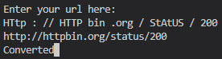

# Testings

## Regex

I used regex to filter out bad domains with non-valid characters and set requirements to include HTTP(s) as the beginning of the string. View the code here: [here](https://regex101.com/r/HJk3sf/1 "regex101.com/r/HJk3sf/1")

 

## Inputs

A lot of work has gone into the validation and checks of inputs. Things like lowering all letters, stripping any extra whitespace, and removing any spaces between letters. If statements to ensure that letters are valid only where intended.

| CONVERTION | NOT VALID INPUT |
|:--------:|:--------:|
|  |  |

 

### Testing URL inputs

| VALID | INVALID |
|:--------:|:--------:|
|  |  |

| 404 ERROR | FAILED TO PARSE | UNREACHABLE |
|:--------:|:--------:|:--------:|
|  |  |  |

 

### Testing Validation Code

| NO ERRORS | WITH ERRORS |
|:--------:|:--------:|
|  |  |

